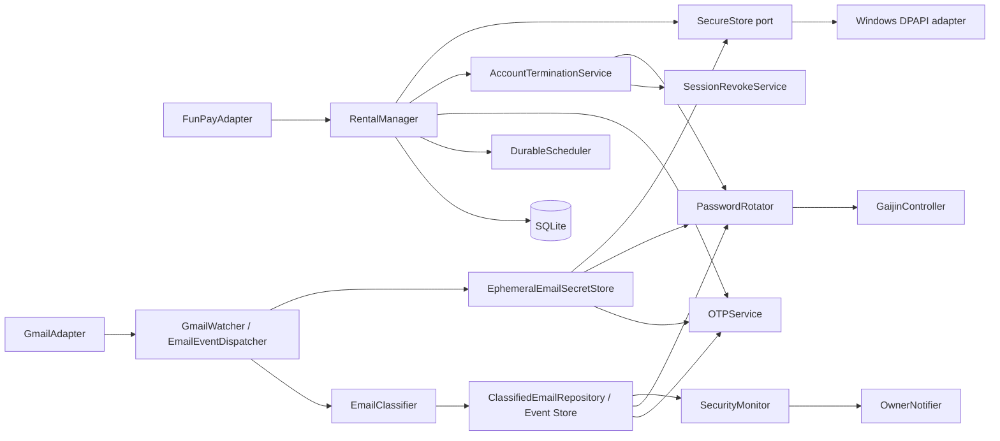
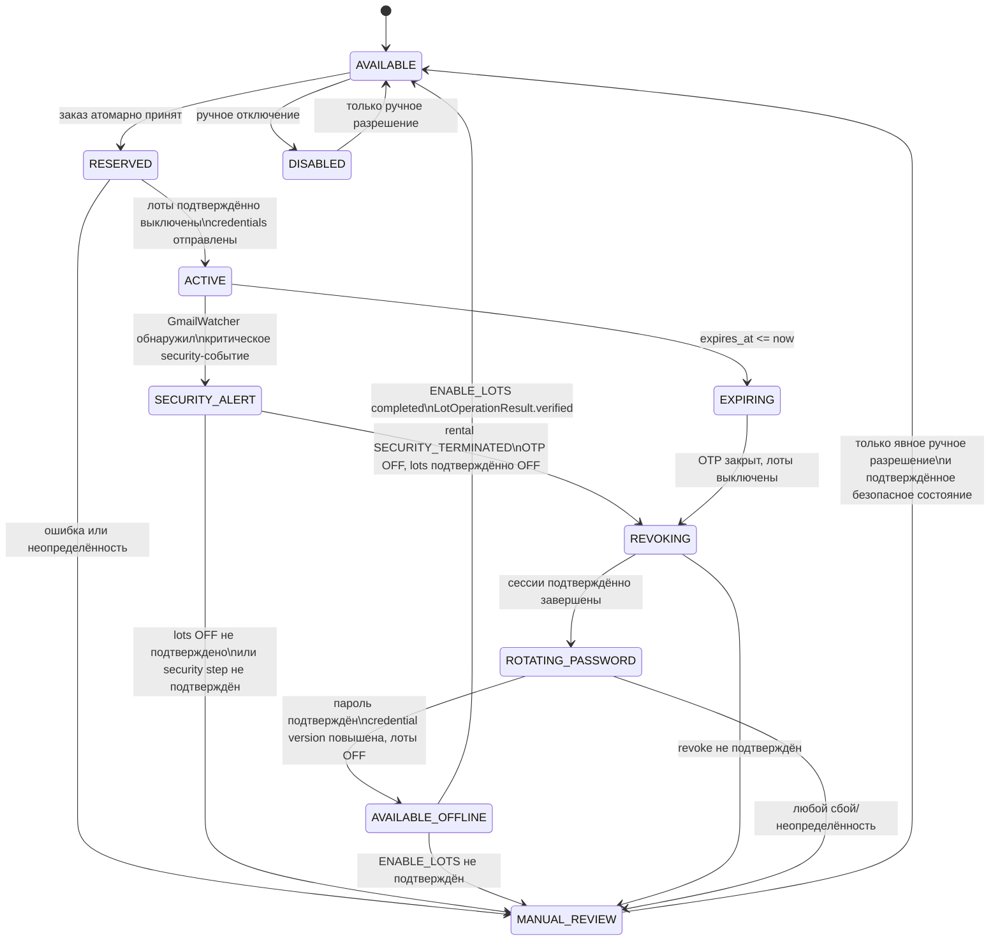
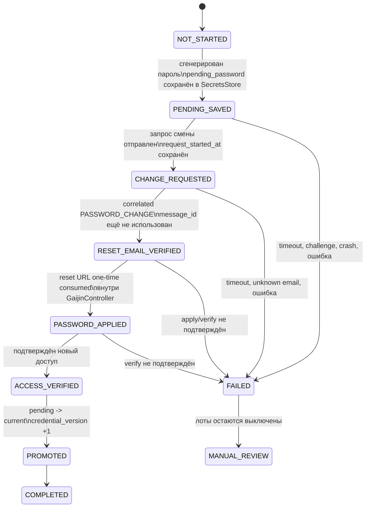

# PHASE 0 — архитектура

## Решение

Система строится вокруг транзакционного `RentalManager`: он единственный изменяет
состояния аренды и аккаунта. Интеграции изолированы адаптерами и вызываются только
сервисами. SQLite хранит бизнес-состояние и идемпотентные ключи; секреты хранятся за
портом `SecureStore`. Неопределённость на любом критичном шаге ведёт к
`MANUAL_REVIEW`, отключённым лотам и уведомлению владельца.



Границы ответственности:

- `domain` — неизменяемые сущности, перечисления, правила переходов и порты;
- `application` — use-case-оркестрация, транзакции, идемпотентность;
- `adapters` — FunPay, Gmail, Gaijin/Playwright, Telegram, Windows DPAPI и fake-реализации;
- `persistence` — SQLAlchemy-модели, репозитории, миграции;
- `security` — безопасное логирование, redaction, policy, генерация паролей;
- `templates` — пользовательские сообщения, без бизнес-логики.

Только `GmailWatcher`/`EmailEventDispatcher` получает письма через `GmailAdapter`.
Он дедуплицирует их по Gmail message ID, классифицирует и атомарно сохраняет
типизированное событие в `ClassifiedEmailRepository`/event store. `OTPService`,
`PasswordRotator` и `SecurityMonitor` получают только уже сохранённые события и не
читают Gmail самостоятельно; claim/корреляция исключают конкурентную независимую
обработку одного письма. Поддерживаемые форматы пока ограничены `LOGIN_OTP` и
`PASSWORD_CHANGE`; `EMAIL_CHANGE`, `2FA_CHANGE`, `SECURITY_CHANGE` и `UNKNOWN`
остаются типами событий без предположений о формате до получения sanitized `.eml`.
`LOGIN_OTP` не является security-событием сам по себе: он только становится доступен
для `OTPService` при выполнении всех условий выдачи. `PASSWORD_CHANGE` выдаётся
`PasswordRotator` только при корреляции с конкретной незавершённой операцией
`ROTATING_PASSWORD`; во время `ACTIVE` или без ожидающей операции он создаёт critical
`SecurityEvent`.

Ожидание `LOGIN_OTP` и `PASSWORD_CHANGE` реализуется подпиской/опросом event store,
а не повторным чтением Gmail: это сохраняет требуемую асинхронную семантику Gmail-модуля
и единственного потребителя Gmail.

Для каждого события `GmailWatcher` создаёт UUID заранее, сохраняет в SQLite только
metadata event и кладёт чувствительный payload под этим `event_id` в
`EphemeralEmailSecretStore`. OTP и reset URL никогда не становятся полем события.
Сначала durable-store получает payload, затем короткая SQLite-транзакция публикует
event metadata; orphaned payload без event удаляется TTL-purge. Если event существует,
но payload отсутствует или истёк, он закрывается как `UNUSABLE_EXPIRED` без попытки
восстановить значение из догадок.

Реальные внешние интеграции не входят в PHASE 0. В PHASE 0–3 опасные действия
доступны только через fake-адаптеры и `DRY_RUN=true`; исключение PHASE 4 определено
в roadmap ниже.

## Дерево каталогов

```text
WarThunder-rent-bot/
├── app/
│   ├── main.py
│   ├── config/
│   │   └── settings.py
│   ├── domain/
│   │   ├── models.py
│   │   ├── states.py
│   │   ├── events.py
│   │   └── ports.py
│   ├── application/
│   │   ├── rental_manager.py
│   │   ├── otp_service.py
│   │   ├── account_termination.py
│   │   ├── password_rotator.py
│   │   ├── scheduler.py
│   │   ├── security_monitor.py
│   │   ├── gmail_watcher.py
│   │   ├── email_event_dispatcher.py
│   │   └── startup_reconciliation.py
│   ├── adapters/
│   │   ├── funpay/{client.py,fake.py}
│   │   ├── gmail/{client.py,classifier.py,watcher.py,fake.py}
│   │   ├── gaijin/{controller.py,selectors.py,fake.py}
│   │   ├── telegram/notifier.py
│   │   └── secure_store/{dpapi.py,email_secrets.py,fake.py}
│   ├── persistence/
│   │   ├── database.py
│   │   ├── repositories.py
│   │   ├── classified_email_events.py
│   │   └── migrations/
│   ├── security/{logging.py,password_policy.py,redaction.py}
│   └── templates/funpay_messages.py
├── tests/{unit,integration}/
├── fixtures/email/                # только sanitized/anonymized .eml
├── docs/
├── data/                         # игнорируется Git; только локальная SQLite
├── .env.example
├── .gitignore
├── pyproject.toml
└── README.md
```

## State machine аренды и аккаунта

Каждый переход выполняется в короткой БД-транзакции с проверкой версии строки аккаунта;
внешние вызовы внутри транзакции запрещены.
Создание аренды использует условное обновление `AVAILABLE -> RESERVED`; уникальный
`funpay_order_id` делает повторную доставку заказа безопасной.



Соответствие состояний аренды: `RESERVED -> ACTIVE -> EXPIRING -> REVOKING ->
PASSWORD_ROTATION -> FINISHED`. Терминальные отклонения: `CANCELLED` и
`MANUAL_REVIEW`; `SECURITY_TERMINATED` — промежуточное состояние аварийного
завершения перед `REVOKING`. При продлении того же покупателя меняется только
`expires_at`; пароль и текущая сессия не меняются.

`AVAILABLE_OFFLINE` — дополнительное внутреннее состояние: пароль уже безопасно
ротирован, но лоты подтверждённо выключены и новая аренда запрещена. Оно устраняет
смешение успешной ротации с подтверждённой готовностью к продаже.
Rental сохраняет `PASSWORD_ROTATION` до `ENABLE_LOTS=COMPLETED`; только затем он
становится `FINISHED`.

При critical security event применяется аварийный путь: `ACTIVE -> SECURITY_ALERT`,
сразу запрещается OTP, подтверждённо выключаются лоты, rental получает
`SECURITY_TERMINATED`, затем аккаунт проходит `REVOKING -> ROTATING_PASSWORD`.
После подтверждённых revoke и ротации пароль переводит аккаунт в `AVAILABLE_OFFLINE`;
`AVAILABLE` возможен только после отдельного подтверждённого включения лотов. Любой
непроверяемый security-critical шаг ведёт в `MANUAL_REVIEW` при выключенных лотах.

Выдача OTP разрешена только при всех условиях: аренда `ACTIVE`, покупатель совпадает,
`now < expires_at`, аккаунт `ACTIVE`, rate limit не превышен. Перед поиском письма
фиксируется `request_started_at`; принимается одно неиспользованное allowlist-письмо,
если одновременно: `message_type == LOGIN_OTP`, strict allowlist matched,
`received_at >= rental.started_at`,
`received_at >= request_started_at - OTP_LOOKBACK_SECONDS`, Gmail message ID не
использован. `OTP_LOOKBACK_SECONDS` — конфигурационный параметр, значение которого
будет подтверждено экспериментально; он покрывает письмо, пришедшее до команды `код`.

### Два оплаченных заказа на один аккаунт

Входящий заказ сначала сохраняется как отдельная запись `orders`. При `12:00:00`
покупателя A и `12:00:01` покупателя B только один поток выполнит условный переход
аккаунта `AVAILABLE -> RESERVED`; с ним создаётся аренда. Второй заказ не теряется:
его `fulfillment_status` становится `FULFILLMENT_BLOCKED`, аренда не создаётся,
credentials не отправляются, а владельцу уходит уведомление. Аккаунт и активная
аренда A остаются неизменны. Разрешение, возврат или иная обработка B выполняются
только отдельно владельцем.

`FULFILLMENT_BLOCKED` — состояние исполнения заказа, не состояние игрового аккаунта
и не причина менять состояние уже активной аренды.

## Durable operations и границы транзакций

SQLite-транзакция не остаётся открытой во время сетевых вызовов FunPay, Gmail, Gaijin,
Telegram или других внешних сервисов. Side effect всегда выполняется как durable,
идемпотентная операция: (1) в короткой транзакции сохранить intent и operation,
(2) commit, (3) выполнить внешний вызов, (4) проверить результат, (5) в новой
транзакции сохранить результат и intent следующего перехода, (6) commit.

Например, начало аренды создаёт `DISABLE_LOTS` вместе с `AVAILABLE -> RESERVED`;
после подтверждённого отключения создаётся `SEND_CREDENTIALS`; только после receipt
сообщения операция помечается `COMPLETED`, а rental — `ACTIVE`. Тот же механизм
обязателен для revoke sessions, request/apply/verify password rotation, enable lots и
уведомлений Telegram, если их результат влияет на workflow. `operations` — источник
crash recovery: воркер возобновляет незавершённые операции по lease/idempotency key и
не повторяет подтверждённый внешний side effect без необходимости.

После успешной ротации создаётся `ENABLE_LOTS` в той же короткой транзакции, которая
переводит аккаунт в `AVAILABLE_OFFLINE`; затем commit, вызов FunPay и проверка
`LotOperationResult.verified`. Только после нового commit с `ENABLE_LOTS=COMPLETED`
аккаунт становится `AVAILABLE`, а post-rental workflow — завершённым. Ошибка или
неподтверждённый результат оставляют лоты OFF, запрещают нового покупателя и создают
operational/security alert с переходом в `MANUAL_REVIEW`. Blind retry запрещён:
повтор возможен только по idempotency key и после проверки фактического состояния.

## State machine ротации пароля



`reset_url` хранится только до one-time consume в `EphemeralEmailSecretStore`; он не
попадает в логи, SQLite, события или сообщения. После аварийного запуска при
`pending_password` или незавершённом шаге — сразу `MANUAL_REVIEW`, без догадок и
автоматического возврата в продажу.

## Защищённое хранение

Прикладной слой использует типизированный порт `SecureStore`, не зная о DPAPI:

```text
SecureStore
├── AccountPasswordStore     current_password / pending_password
├── OAuthTokenStore          Gmail OAuth refresh token
├── WebSessionStore          FunPay session / golden_key и Gaijin-session data
├── EphemeralEmailSecretStore one-time OTP и reset URL по event_id
└── ApplicationSecretStore   Telegram bot token и прочие application secrets
```

В Windows порт реализуется `WindowsDpapiSecureStore`; fake-реализация используется
в тестах. Обычная SQLite не содержит секретов, а redaction обязателен для логов,
traceback, audit metadata и Telegram. `SecretStr`/`SecretUrl` не сериализуются вне
границ соответствующего адаптера.

`EphemeralEmailSecretStore` — специализированное DPAPI-backed подхранилище: он
связывает payload только с `classified_email_event.id`, задаёт короткий настраиваемый
TTL для `LOGIN_OTP` и TTL до завершения/отмены коррелированной ротации для reset URL.
`consume_once` атомарно забирает и удаляет значение; после успешного использования,
окончательного отказа или expiry оно удаляется. Периодический `purge_expired` очищает
просроченные и orphaned записи. Payload не входит в correlation IDs, idempotency keys,
safe metadata, audit events, traceback или Telegram.

При claim event сначала получает единственный DB claim token, затем этот token выполняет
`consume_once`. Если процесс упал после consume, event не может быть использован
повторно: при recovery без payload он закрывается как unusable. Для `LOGIN_OTP`
покупатель инициирует новый вход. Для ожидаемого `PASSWORD_CHANGE` — `MANUAL_REVIEW`,
кроме отдельной будущей durable operation, для которой доказана безопасная повторная
отправка запроса и создано новое ожидаемое событие; поведение Gaijin здесь не
предполагается.

## Контракты портов

```python
class FunPayAdapter(Protocol):
    async def get_new_orders(self) -> Sequence[FunPayOrder]: ...
    async def get_messages(self) -> Sequence[FunPayMessage]: ...
    async def send_message(self, buyer_id: str, text: str) -> MessageReceipt: ...
    async def disable_account_lots(self, account_id: UUID) -> LotOperationResult: ...
    async def enable_account_lots(self, account_id: UUID) -> LotOperationResult: ...

@dataclass(frozen=True)
class LotOperationResult:
    requested_lot_ids: tuple[str, ...]
    changed_lot_ids: tuple[str, ...]
    verified: bool
    failed_lot_ids: tuple[str, ...]

class GmailAdapter(Protocol):
    async def get_new_messages(self, *, after: datetime) -> Sequence[RawEmail]: ...

class GmailWatcher(Protocol):
    async def poll_once(self) -> Sequence[ClassifiedEmailEvent]: ...

class ClassifiedEmailRepository(Protocol):
    async def claim_login_otp(
        self, *, rental_id: UUID, buyer_id: str, requested_at: datetime
    ) -> LoginOtpEvent | None: ...
    async def claim_expected_password_change(
        self, *, rotation_operation_id: UUID
    ) -> PasswordChangeEvent | None: ...
    async def record_security_event(self, event: ClassifiedEmailEvent) -> None: ...

class EphemeralEmailSecretStore(Protocol):
    async def put(
        self, event_id: UUID, payload: EmailSensitivePayload, *, expires_at: datetime
    ) -> None: ...
    async def consume_once(
        self, event_id: UUID, *, claim_token: UUID
    ) -> EmailSensitivePayload | None: ...
    async def discard(self, event_id: UUID) -> None: ...
    async def purge_expired(self, now: datetime) -> int: ...

class GaijinController(Protocol):
    async def request_password_change(self) -> None: ...
    async def apply_new_password(self, reset_url: SecretUrl, password: SecretStr) -> None: ...
    async def revoke_other_sessions(self) -> None: ...
    async def verify_account_access(self, password: SecretStr) -> bool: ...

class AccountPasswordStore(Protocol):
    async def get_current_password(self, account_id: UUID) -> SecretStr: ...
    async def set_pending_password(self, account_id: UUID, password: SecretStr) -> None: ...
    async def promote_pending_password(self, account_id: UUID) -> None: ...
    async def clear_pending_password(self, account_id: UUID) -> None: ...

class OAuthTokenStore(Protocol):
    async def get_gmail_refresh_token(self) -> SecretStr: ...
    async def set_gmail_refresh_token(self, token: SecretStr) -> None: ...

class WebSessionStore(Protocol):
    async def get_funpay_session(self, account_id: UUID) -> SecretStr | None: ...
    async def set_funpay_session(self, account_id: UUID, value: SecretStr) -> None: ...
    async def clear_funpay_session(self, account_id: UUID) -> None: ...
    async def get_gaijin_session_data(self, account_id: UUID) -> SecretStr | None: ...
    async def set_gaijin_session_data(self, account_id: UUID, value: SecretStr) -> None: ...
    async def clear_gaijin_session_data(self, account_id: UUID) -> None: ...

class ApplicationSecretStore(Protocol):
    async def get_telegram_bot_token(self) -> SecretStr: ...

class OwnerNotifier(Protocol):
    async def notify(self, event: OwnerEvent) -> None: ...
```

`RentalManager` принимает заказ и продление, `OTPService` обслуживает только команду
`код`, `AccountTerminationService` выполняет окончание аренды, `PasswordRotator`
владеет всей машиной ротации. Все внешние ошибки преобразуются в типизированный
результат; для security-critical отказов вызывается единый fail-closed путь.
`LotOperationResult.verified == false` запрещает выдачу credentials и переводит
операцию в `MANUAL_REVIEW`; включение лотов допустимо только после подтверждённого
состояния аккаунта `AVAILABLE`.

## SQLite-схема

| Таблица | Назначение и ключевые поля |
|---|---|
| `accounts` | `id`, `code` UNIQUE, `status`, `credential_version`, `state_version`, `rotation_state`, `created_at`, `updated_at` |
| `account_lots` | `id`, `account_id` FK, `funpay_lot_id` UNIQUE, `tariff_code`, `enabled_expected` |
| `orders` | `id`, `funpay_order_id` UNIQUE, `funpay_buyer_id`, `tariff_code`, `account_id` nullable FK, `fulfillment_status`, `received_at`, `resolved_at`, `safe_metadata_json` |
| `rentals` | `id`, `order_id` UNIQUE FK, `funpay_buyer_id`, `account_id` FK, `tariff_code`, `started_at`, `expires_at`, `status`, `credential_version`, `created_at`, `updated_at` |
| `processed_messages` | ingestion ledger: `source`, `external_message_id`, `processed_at`; UNIQUE(`source`, `external_message_id`) |
| `classified_email_events` | `id`, `gmail_message_id` UNIQUE, `message_type`, `received_at`, `routing_target`, `correlation_operation_id` nullable FK, `claim_token` nullable, `claimed_by` nullable, `claimed_at` nullable, `payload_state`, `safe_metadata_json` |
| `otp_requests` | `id`, `rental_id` FK, `buyer_id`, `requested_at`, `outcome`, `gmail_message_id` nullable UNIQUE |
| `security_events` | `id`, `account_id` FK, `rental_id` nullable FK, `type`, `severity`, `occurred_at`, `safe_metadata_json` |
| `audit_events` | `id`, `occurred_at`, `account_id`, `rental_id`, `event_type`, `safe_metadata_json`, `correlation_id` |
| `operations` | `id`, `kind`, `idempotency_key` UNIQUE, `status`, `account_id`, `rental_id`, `order_id`, `correlation_id`, `attempt_count`, `lease_until`, `started_at`, `completed_at`, `safe_metadata_json` |

Время хранится в UTC ISO-8601 с offset либо как UTC datetime через SQLAlchemy;
на границах API оно всегда timezone-aware. Индексы: `rentals(status, expires_at)`,
`orders(fulfillment_status, received_at)`,
`classified_email_events(message_type, correlation_operation_id)`, `accounts(status)`,
`audit_events(account_id, occurred_at)`. Пароли, OTP, токены, cookies, reset URL и
их производные отсутствуют во всех таблицах. `payload_state` содержит только статус
(`AVAILABLE`, `CONSUMING`, `CONSUMED`, `UNUSABLE_EXPIRED`), а не значение payload.

## Roadmap

| Этап | Результат и gate |
|---|---|
| PHASE 0 | Архитектура в этом документе; реальных интеграций нет. |
| PHASE 1 | Конфигурация, домен, SQLite, миграции, manager, scheduler, audit, durable operations/outbox, fake adapters и fake lifecycle-тест. |
| PHASE 2 | Парсер `.eml`, строгий EmailClassifier, единый GmailWatcher/event store, Gmail OAuth adapter, dedupe и тесты, доказывающие невозможность выдачи password email как OTP. |
| PHASE 3 | Исследование FunPay и изолированный adapter сначала в `DRY_RUN`; CAPTCHA/неизвестность — `MANUAL_REVIEW`. |
| PHASE 4 | Сначала отдельные read-only Gaijin checks. Любой реальный security-changing тест через Playwright — только после отдельного явного подтверждения владельца для конкретного действия; CAPTCHA/challenge/rate limit не обходятся. |
| PHASE 5 | Sandbox/dry-run объединённый workflow FunPay + Gmail + Gaijin + Telegram. |
| PHASE 6 | Recovery, retry/backoff/rate limits, health checks, watchdog, backups, эксплуатационная документация и security review. |

Переход между этапами только после тестов, lint/type-check и отдельного разрешения
владельца. PHASE 1 без такого разрешения не начинается.

## Критические security-риски и инварианты

1. Неверная классификация письма может раскрыть reset URL. Разрешён только строгий
   `LOGIN_OTP` allowlist; всё прочее — `DENY`.
2. Старая или повторно использованная почта может раскрыть OTP. Нужны timestamp,
   clock skew, Gmail message ID и уникальная обработка.
3. Race condition может выдать аккаунт двум покупателям. Нужны транзакционное
   conditional update, уникальный order ID, optimistic `state_version` и отдельное
   `FULFILLMENT_BLOCKED` для конфликтующего оплаченного заказа.
4. Сбой ротации может потерять доступ. Нужны DPAPI-backed `current/pending`,
   проверка доступа до promote и `MANUAL_REVIEW` при любой неопределённости.
5. Частично завершённая аренда опасна. Сначала закрывается OTP и выключаются лоты;
   отключение и включение требуют `LotOperationResult.verified`; лоты включаются
   только после подтверждённого `AVAILABLE`.
6. Утечка секретов возможна через логи, tracebacks и Telegram. Нужны typed secrets,
   redaction и safe metadata allowlist.
7. Web-сессии FunPay/Gaijin и OAuth refresh token равны паролям. Они хранятся только
   в защищённом хранилище, не коммитятся и не логируются.
8. CAPTCHA, rate limit, security challenge или неизвестный ответ нельзя обходить;
   они завершают автоматизацию fail-closed и требуют ручного действия.
9. Security-письмо может прийти без команды `код`. `GmailWatcher` обязан обнаружить
   его, отключить OTP/лоты через fail-closed сценарий и уведомить владельца.
10. Gmail message ID имеет единственного низкоуровневого потребителя. Только
    `GmailWatcher` читает Gmail и атомарно публикует classification event; сервисы
    используют claim/корреляцию event store, а не опрашивают Gmail.
11. Открытая SQLite-транзакция не охватывает внешние side effects. Они исполняются
    через `operations` с idempotency key, проверяемым результатом и crash recovery.
12. OTP и reset URL существуют только в `EphemeralEmailSecretStore`, имеют TTL и
    one-time consume; event metadata без payload не становится основанием для выдачи.
13. Успешная ротация не делает аккаунт доступным для новой аренды: до
    `ENABLE_LOTS=COMPLETED` и `LotOperationResult.verified` он остаётся
    `AVAILABLE_OFFLINE` с выключенными лотами.

## Данные, которые нужно получить вручную до соответствующих интеграций

- sanitized/anonymized `.eml` для всех новых security-сценариев, если они появятся;
- подтверждённые требования к новому паролю и полный, легитимный flow страницы
  смены пароля: повтор ввода, дополнительные проверки и успешный результат;
- штатный подтверждаемый способ revoke/logout остальных сессий;
- актуальные разрешённые правила FunPay: получение заказа, сообщения, лоты,
  продление, авторизация и ручное обновление сессии;
- перечень лотов, тарифов и их точное соответствие аккаунтам;
- согласованные значения rate limit, timeout, clock skew, TTL для OTP/reset URL и
  текстов сообщений;
- OAuth consent для Gmail и подтверждённый безопасный способ хранения токенов;
- владелец Telegram, канал уведомлений и процедура ручного вывода из
  `MANUAL_REVIEW`.

До получения этих данных соответствующие адаптеры остаются интерфейсами/fake и не
делают предположений о поведении внешних сервисов.

## Fixtures и Git

В `fixtures/email/` допускаются только sanitized/anonymized копии реальных писем,
например `login_confirmation.sanitized.eml`. До добавления заменяются или удаляются
реальный email и user ID, reset tokens и персональные reset URL, session/security
identifiers, другие персональные данные и секреты. Достаточная для классификатора
структура, заголовки и признаки письма сохраняются. Оригинальные `.eml` в проект не
попадают.

Git управляется только владельцем проекта. Codex не выполняет без отдельной прямой
команды владельца `git init`, `add`, `commit`, `branch`, `checkout`, `switch`, `merge`,
`rebase`, `push`, `pull`, `remote` и другие операции, меняющие репозиторий, историю,
ветки или remote. `.gitignore` допустим как часть структуры, но не является разрешением
на Git-операции.
